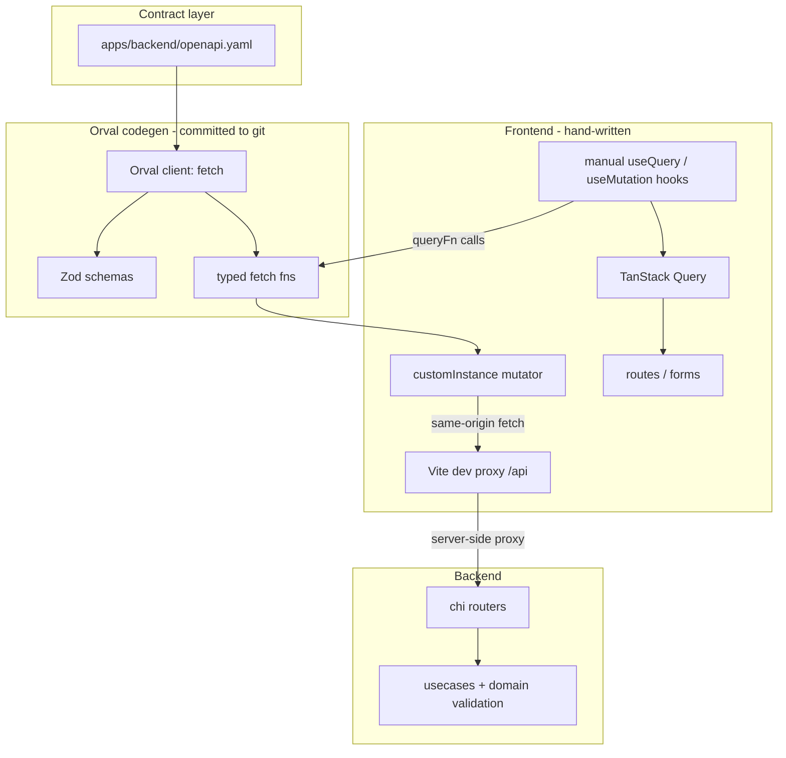
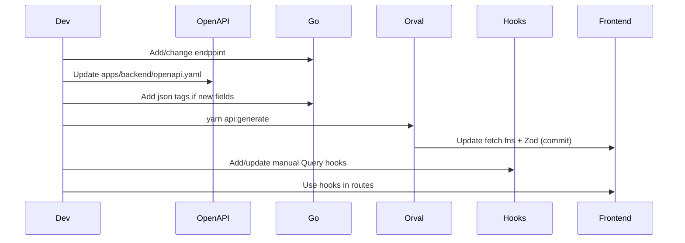

# Master plan: OpenAPI + Orval typed API client

Typed, Zod-validated frontend API consumption for the Instech Go backend and TanStack frontend.

Update each phase **Status** to `implemented` when that phase is complete.

---

## Phase overview

| Phase | Name | Status |
|-------|------|--------|
| 1 | OpenAPI spec | `implemented` |
| 2 | Backend hygiene | `pending` |
| 3 | Orval setup | `pending` |
| 4 | Manual TanStack Query hooks | `pending` |
| 5 | Contract sync (CI) | `pending` |

---

## Goal

- **Compile-time** types from OpenAPI
- **Runtime** Zod `.parse()` on every request body and response (prod included)
- **Manual TanStack Query hooks** — Orval generates fetch fns + Zod only; you own `queryKey`, `queryFn`, `enabled`, etc.
- **Minimal backend change** — keep chi + usecase pattern

---

## Decisions (locked in)

| Topic | Choice |
|-------|--------|
| Generated code | **Commit** `src/api/generated/` to git |
| Response validation | **Always** `.parse()` — no dev-only relaxation |
| MSW mocks | **No** — Orval mock generation disabled |
| Spec location | [`apps/backend/openapi.yaml`](../apps/backend/openapi.yaml) |
| Serve spec over HTTP | **No** — no `GET /openapi.json` |
| Dev CORS | **No change** — Vite proxy makes browser requests same-origin |
| Orval output | **Fetch client + Zod only** — no `react-query` hooks |

---

## Architecture



**Authoritative validation** stays in Go domain/usecase ([`domain.CreateTool`](../apps/backend/internal/domain/tool.go)). Frontend Zod is UX + drift detection only.

---

## Repo layout

```
apps/backend/
  openapi.yaml                      # source of truth (backend project root)
  internal/feature/*/usecase/*.go   # json tags on request structs

apps/frontend/
  orval.config.ts
  .env.example                      # VITE_API_BASE_URL=/api
  src/api/
    mutator.ts                      # custom fetch + HTTPError handling
    tools.ts                        # manual Query hooks for /tools/*
    relationships.ts                # manual Query hooks for /relationships/*
    generated/                      # Orval output — COMMITTED
      instech.ts
      model/
      *.zod.ts
```

Orval input path from frontend: `../backend/openapi.yaml` (relative to `apps/frontend/`).

---

## Phase 1 — OpenAPI spec

**Status:** `implemented`

Create [`apps/backend/openapi.yaml`](../apps/backend/openapi.yaml).

### Tasks

- [x] Define shared `components/schemas` (see table below)
- [x] Define reusable error responses (400, 404, 422, 500 → `HTTPError`)
- [x] Document all 12 paths with methods, status codes, request/response refs
- [x] Start with tools CRUD as template; copy pattern for remaining paths

### Shared components (`components/schemas`)

| Schema | Source in Go |
|--------|--------------|
| `HTTPError` | [`httprouter.HTTPError`](../apps/backend/internal/infra/httprouter/response.go) |
| `Tool` | [`domain.Tool`](../apps/backend/internal/domain/tool.go) |
| `CreateToolRequest` / `UpdateToolRequest` | usecase inputs |
| `Relationship` | [`domain.Relationship`](../apps/backend/internal/domain/relationship.go) |
| `CreateRelationshipRequest` / `UpdateRelationshipRequest` | usecase inputs |
| `RelationshipMetadata` | `domain.RelationshipMetadata` |
| `ToolAlternative` | [`ToolAlternativesResult`](../apps/backend/internal/feature/tool/usecase/getalternativestool.go) — `id` is slug |
| `ClientRelationship` / `RelationshipListResponse` | [`ClientRelationshipResult`](../apps/backend/internal/feature/relationship/usecase/getrelationships.go) |
| Enums | `ToolCategories`, `ToolSubtypes`, `ToolDevStatuses`, `RelationshipKinds` |

Use `format: date-time` for timestamps, `enum` for allowed values where domain defines them.

### Reusable error responses

| Status | Used when |
|--------|-----------|
| 400 | Bad JSON, invalid enum, duplicate slug |
| 404 | Tool/relationship not found |
| 422 | `ErrInvalidField` (field map in `details`) — tools only |
| 500 | Unexpected server error |

Note: relationships use 400 (not 422) for `ErrInvalidField` — spec must match actual handlers.

### Paths (12 endpoints)

| Method | Path | Body | Success |
|--------|------|------|---------|
| GET | `/` | — | `{ message: string }` |
| GET | `/search` | query `q` | `{ message: string }` |
| POST | `/tools/` | `CreateToolRequest` | 201 `Tool` |
| GET | `/tools/{id}` | — | 200 `Tool` |
| PUT | `/tools/{id}` | `UpdateToolRequest` | 200 `Tool` |
| DELETE | `/tools/{id}` | — | 204 |
| GET | `/tools/{id}/alternatives` | — | 200 `ToolAlternative[]` |
| GET | `/tools/{id}/graph` | — | 200 stub |
| POST | `/relationships/` | `CreateRelationshipRequest` | 201 `Relationship` |
| PUT | `/relationships/{id}` | `UpdateRelationshipRequest` | 200 `Relationship` |
| DELETE | `/relationships/{id}` | — | 204 |
| GET | `/relationships/query` | query `tool_id`, `kind`, `cursor`, `limit` | 200 `RelationshipListResponse` |

Tools `{id}` = slug (string); relationships `{id}` = integer.

### Spec conventions

- `openapi: 3.1.0` (or 3.0.3 if Orval config prefers)
- `info.title`: Instech API; `servers`: `{ url: http://localhost:8801 }`
- All JSON property names: **snake_case**
- Tag groups: `tools`, `relationships`, `misc`

---

## Phase 2 — Backend hygiene

**Status:** `pending`

Minimal backend changes only — no new routes, no CORS edits, no spec HTTP endpoint.

### Tasks

- [ ] Add `json:"snake_case"` tags to [`AddToolInput`](../apps/backend/internal/feature/tool/usecase/addtool.go)
- [ ] Add tags to `UpdateToolInput` (tool usecase)
- [ ] Add tags to `CreateRelationshipInput` (relationship usecase)
- [ ] Add tags to `UpdateRelationshipInput` (relationship usecase)
- [ ] Verify existing integration tests still pass (they already send snake_case JSON)

### CORS — not needed for local dev with proxy

```
Browser  →  GET localhost:8800/api/tools/golang   (same origin)
Vite     →  GET localhost:8801/tools/golang       (server-side, no CORS)
```

| Scenario | CORS needed? |
|----------|--------------|
| Local dev via `VITE_API_BASE_URL=/api` + Vite proxy | **No** |
| Browser calls API directly (`VITE_API_BASE_URL=http://localhost:8801`) | **Yes** |
| Production frontend on different origin than API | **Yes** — ensure deployed origin is in [`AllowedOrigins`](../apps/backend/internal/core/router.go) |

**Action:** skip CORS changes for this work.

---

## Phase 3 — Orval setup

**Status:** `pending`

Orval generates TypeScript types, Zod schemas, and per-endpoint fetch functions only. No Query hooks, no MSW.

### Tasks

- [ ] Add `orval` to `apps/frontend` devDependencies (pin exact version; verify Zod 4 compatibility)
- [ ] Create [`apps/frontend/orval.config.ts`](../apps/frontend/orval.config.ts)
- [ ] Add `"api:generate": "orval --config orval.config.ts"` script
- [ ] Create [`apps/frontend/src/api/mutator.ts`](../apps/frontend/src/api/mutator.ts)
- [ ] Run `yarn api:generate` and commit `src/api/generated/`
- [ ] Add `apps/frontend/.env.example` with `VITE_API_BASE_URL=/api`
- [ ] Add Vite dev proxy in [`vite.config.ts`](../apps/frontend/vite.config.ts)

### `orval.config.ts`

```typescript
import { defineConfig } from 'orval'

export default defineConfig({
  instech: {
    input: '../backend/openapi.yaml',
    output: {
      mode: 'split',
      target: './src/api/generated/instech.ts',
      schemas: './src/api/generated/model',
      client: 'fetch',
      mock: false,
      override: {
        mutator: {
          path: './src/api/mutator.ts',
          name: 'customInstance',
        },
        zod: {
          generate: {
            body: true,
            response: true,
            query: true,
            param: true,
          },
        },
      },
    },
  },
})
```

### Custom mutator (`src/api/mutator.ts`)

- Prefix `import.meta.env.VITE_API_BASE_URL`
- JSON headers, error handling
- Non-2xx → parse `HTTPError`, throw typed `ApiError`
- 204 → `undefined`
- Orval-generated fetch fns call mutator; Zod `.parse()` runs on body/response inside generated code

### Dev proxy (required)

[`vite.config.ts`](../apps/frontend/vite.config.ts):

```typescript
server: {
  proxy: {
    '/api': {
      target: 'http://localhost:8801',
      changeOrigin: true,
      rewrite: (path) => path.replace(/^\/api/, ''),
    },
  },
},
```

Do **not** point `VITE_API_BASE_URL` at `:8801` in dev unless backend CORS is updated.

---

## Phase 4 — Manual TanStack Query hooks

**Status:** `pending`

You own all Query integration. Orval fetch fns are called from `queryFn` / `mutationFn`.

### Tasks

- [ ] Create `src/api/tools.ts` — query key factory + hooks for `/tools/*`
- [ ] Create `src/api/relationships.ts` — hooks for `/relationships/*`
- [ ] Wire reference route: `GET /tools/{slug}` via `useTool`
- [ ] Reuse Orval-generated request Zod schemas in TanStack Form validators where applicable

### Query key factory

```typescript
// src/api/tools.ts
export const toolKeys = {
  all: ['tools'] as const,
  detail: (slug: string) => [...toolKeys.all, slug] as const,
  alternatives: (slug: string) => [...toolKeys.detail(slug), 'alternatives'] as const,
}
```

### Hook pattern

```typescript
import { useQuery, useMutation, useQueryClient } from '@tanstack/react-query'
import { getToolsId, postTools } from './generated/instech'

export function useTool(slug: string, options?: { enabled?: boolean }) {
  return useQuery({
    queryKey: toolKeys.detail(slug),
    queryFn: () => getToolsId(slug),
    enabled: options?.enabled ?? !!slug,
  })
}

export function useCreateTool() {
  const queryClient = useQueryClient()
  return useMutation({
    mutationFn: (body: CreateToolRequest) => postTools(body),
    onSuccess: () => queryClient.invalidateQueries({ queryKey: toolKeys.all }),
  })
}
```

Full control over `staleTime`, `retry`, `placeholderData`, `select`, etc.

---

## Phase 5 — Contract sync (CI)

**Status:** `pending`

### Tasks

- [ ] Add CI step: `yarn api:generate` in frontend job
- [ ] Fail CI if `git diff --exit-code apps/frontend/src/api/generated/` is non-empty
- [ ] Run `tsc --noEmit` after codegen
- [ ] Document PR rule: handler or request DTO change → update `openapi.yaml` + regen + commit in same PR

### PR checklist (ongoing)

1. Handler or request DTO changed → update [`apps/backend/openapi.yaml`](../apps/backend/openapi.yaml)
2. Run `yarn api:generate`
3. Commit generated diff
4. Add/update manual Query hooks for new endpoints

### Optional later

- Schemathesis against integration test DB to fuzz spec vs live API

---

## Workflow



---

## Risks / flaws

1. **Client Zod is not security** — Go domain remains authoritative.
2. **OpenAPI drift** — CI git-diff check on `generated/` catches forgotten regen.
3. **`HTTPError.details` is polymorphic** — document variants in spec; narrow in mutator if needed.
4. **Inconsistent validation HTTP status** — tools 422 vs relationships 400 for field errors; spec must match actual handlers.
5. **Always `.parse()` cost** — large paginated lists parse every item every fetch.
6. **Manual hooks maintenance** — new endpoints need spec regen AND hand-written hook.
7. **`ToolAlternative.id` is slug** — name clearly in spec to avoid confusion with numeric `Tool.id`.
